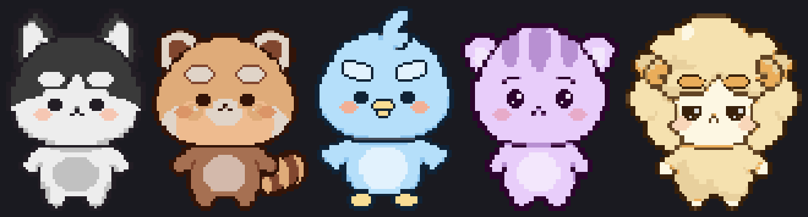

# yamulttak-pet




macOS 바탕화면을 걸어다니는 데스크탑 펫. "사회인 게임클럽" 5인방이 각자 자기 아이템을
들고 돌아다닌다. Electron + 캔버스 픽셀아트, 이미지 에셋 없이 코드로 스프라이트를 그린다.

## 실행

```bash
npm install
npm run dev
```

- Dock 아이콘은 숨겨진다. **메뉴바의 고양이 머리 아이콘**이 유일한 진입점이다 —
  오버레이 숨기기/보이기, 설정, 종료 모두 거기서. (`Cmd+Option+Q` 로도 종료된다)
- 메뉴바가 꽉 차 있으면 macOS 가 아이콘을 안 보여줄 수 있다. 다른 아이콘을
  정리하거나 `Cmd+Option+Q` 로 종료하면 된다.
- 렌더러 로그를 터미널에서 보려면 그냥 `npm run dev` (개발 모드에서 자동 포워딩).
- 클릭 통과 토글을 추적하려면 `PET_DEBUG=1 npm run dev`.
- DevTools 를 띄우려면 `PET_DEVTOOLS=1 npm run dev`.
- 설정 창을 트레이 안 거치고 바로 띄우려면 `PET_SETTINGS=1 npm run dev`.

## 설정

메뉴바 → **설정…** (`Cmd+,`). 고르는 즉시 저장되고 오버레이에 바로 반영된다.
저장 위치는 `~/Library/Application Support/yamulttak-pet/settings.json`.

| 항목 | 값 |
| --- | --- |
| 캐릭터 | 5종 중 화면에 띄울 친구 (최소 한 마리) |
| 크기 | 도트 1 / 2 / 3 배 |
| 속도 | 느긋 / 보통 / 촐싹 |
| 혼잣말 | 가끔 말풍선 띄우기 |
| 로그인 시 자동 실행 | macOS 로그인 항목 |

`characters` 가 빈 배열이면 "전부"라는 뜻이다 — 나중에 캐릭터를 추가해도
설정을 안 건드린 사람 화면에 자동으로 끼워진다.

메뉴바 아이콘은 캐릭터 도트에서 만든다 (macOS 템플릿 이미지):

```bash
node tools/make-tray-icon.mjs [캐릭터id]   # assets/trayTemplate.png (+@2x)
```

## 배포용 앱 만들기

```bash
npm run pack        # dist/yamulttak-pet-0.1.0-arm64.dmg (+ .zip)
```

아이콘은 캐릭터 도트에서 만든다 (`npm run icon` — `pack` 이 알아서 부른다).
지금은 Apple Silicon(arm64) 전용이다. 인텔까지 한 파일로 묶으려면
`npm run pack:universal`.

### 설치 (받는 사람)

1. `.dmg` 를 열고 **SGC Pet** 을 Applications 로 끌어다 놓는다
2. 처음 한 번만 — 확인 안 된 개발자라 그냥 열면 막힌다:
   - **Finder 에서 우클릭 → 열기 → 열기** (더블클릭 말고)
   - 그래도 "손상되었다" 고 하면:
     `xattr -dr com.apple.quarantine "/Applications/SGC Pet.app"`
3. Dock 에는 안 뜬다. **메뉴바의 고양이 머리 아이콘**이 전부다 —
   오버레이 숨기기/보이기, 설정, 종료.

정식 서명·공증(Apple Developer 연간 $99)을 안 했기 때문에 필요한 절차다.
인증서가 생기면 `build.mac.identity` 만 채우면 된다.

### 포장하면서 걸렸던 것들

- **번들 이름은 ASCII 여야 한다.** `productName` 을 한글로 두면 실행파일 이름도
  한글이 되는데, 그러면 앱이 켜지자마자 V8 에서 트랩을 걸고 죽는다(exit 133).
  번들은 `SGC Pet`, 사용자에게 보이는 이름은 `CFBundleDisplayName` 으로 한글.
- **다시 서명해야 한다.** 포장하면서 Info.plist 를 갈아끼우면 Electron 이 달고
  나온 서명이 깨지고, Apple Silicon 은 그런 바이너리를 실행시키지 않는다.
  `tools/sign-adhoc.cjs` 가 애드혹으로 다시 서명한다.
- **JIT 권한이 필요하다.** 서명할 때 `assets/entitlements.mac.plist` 를 안 물리면
  V8 이 실행 가능한 메모리를 못 얻어 또 트랩을 건다. `--deep` 은 중첩 번들에
  권한을 제대로 못 물려서, 프레임워크 → 헬퍼 → 본체 순으로 직접 서명한다.
- `LSUIElement: true` 로 Dock 아이콘을 뺀다 (`app.dock.hide()` 보다 확실하다).

## 현재 진행 상황

- [x] **Phase 1** — Electron 스캐폴딩 + 투명 클릭통과 오버레이 + 임시 사각형 워킹
- [x] **Phase 2** — 스프라이트 시스템 + 강초당 + 스프라이트 디버그 페이지
- [x] **Phase 3** — 드래그/던지기 물리 + 말풍선 채팅
- [ ] Phase 4 — 이름표 (캐릭터 5종은 Phase 2 에서 완료)
- [x] **Phase 5** — 트레이 메뉴 + 설정 저장/복원 (빌드는 아직)

## 스프라이트

도트는 이미지 에셋을 번들하지 않고 **문자열 비트맵**으로 들고 있다.
`art-source/` 의 원본 PNG 5장에서 빌드타임에 추출한다.

### 디자인 기록

`src/renderer/characters/*.js` 가 디자인의 원본이지만 문자열이라 눈으로 볼 수가 없다.
`art/` 에 그때그때 모습을 PNG 로 내보내 둔다.

```bash
npm run export   # art/ 에 초상 + 상태시트 + lineup + palettes.txt
```

| 파일 | 내용 |
|---|---|
| `art/lineup.png` | 5종 한 줄 (바닥 정렬) |
| `art/<id>.png` | 캐릭터별 서 있는 모습 |
| `art/<id>-states.png` | 캐릭터별 전 상태 × 전 프레임 |
| `art/palettes.txt` | 캐릭터별 크기와 팔레트 hex |

### 원본 도트

`art-source/` 에 원본 PNG(1254×1254) 를 둔다. 용량이 커서 저장소에는 올리지 않는다 —
최종 결과는 `characters/*.js` 와 `art/` 에 다 들어 있다. 도트를 다시 뽑으려면 원본이
있어야 하니 따로 백업해 둘 것.

```bash
node tools/extract-characters.mjs   # 원본 PNG → src/renderer/characters/*.js 재생성
npm run sprites                     # 브라우저 디버그 페이지 (캐릭터 × 상태 × 프레임)
npm run sprites:png                 # tools/sprite-sheet.png 로 굽기 (브라우저 없이)
```

### 도트 직접 고치기

```bash
npm run dots     # http://localhost:4322 — 브라우저 에디터
```

자동 추출이 못 잡는 건 여기서 직접 찍는다. 왼클릭 칠하기(드래그 가능),
우클릭 지우기, `Alt+클릭` 스포이드, `⌘Z` 되돌리기, `⌘S` 저장. **좌우 대칭**을
켜면 반대쪽도 같이 찍힌다.

저장하면 캐릭터 파일이 아니라 `tools/overrides/<id>.json` 에 **바뀐 칸만**
들어간다. 추출을 다시 돌려도 손수정이 안 날아가게 하려는 것이다 —
파이프라인이 마지막에 이 목록을 얹는다(걷기/앉기 프레임을 만들기 전이라
고친 도트가 모든 자세에 따라간다).

```bash
node tools/extract-characters.mjs   # 저장한 수정본까지 반영해서 재생성
```

- 색은 팔레트 글자가 아니라 **hex** 로 저장한다. 글자는 양자화할 때마다 뒤바뀐다.
- 팔레트에 없던 색을 찍으면 팔레트가 한 칸 늘어난다.
- 원본 PNG 나 추출 기준이 바뀌어 **스프라이트 크기가 달라지면** 좌표가 의미를
  잃으므로 그 캐릭터의 수정본은 건너뛰고 경고를 찍는다. 다시 찍어야 한다.
- 에디터가 보여주는 밑그림은 저장된 캐릭터 파일이 아니라 **수정본을 뺀 추출
  결과**다. 그래야 저장할 때마다 차이가 누적되지 않는다.

### 추출 파이프라인

원본은 도트를 부드럽게 업스케일한 이미지라 정수 격자가 없다. `tools/extract-lib.mjs` 가:

1. 배경(흰색/투명)을 빼고 바운딩 박스를 잡는다
2. 어두운 획의 가로 런 길이 최빈값으로 **원본 1픽셀 크기**를 역산한다
3. 그 격자의 **블록 중심 median** 으로 샘플링한다 — 평균을 내면 1px 외곽선이 뭉개진다
4. k-means 로 팔레트를 뽑되 **가장 어두운 색(외곽선)은 고정 클러스터**로 남긴다
5. 실루엣이 좌우로 갈라지는 지점을 찾아 **다리**를, 안쪽 어두운 덩어리 쌍으로 **눈**을 검출한다
6. 검출한 자리에 **눈을 다시 찍는다** — 아래 참고

추출에서 특히 조심한 것 두 가지:

- **배경 판정**은 "흰색/투명"이 아니라 *가장자리에서 흘러 들어올 수 있는* 흰색/투명이다.
  색만 보고 판정하면 캐릭터 안쪽의 흰 하이라이트(구라베 볼 등)까지 뚫려서 투명 구멍이 생기고,
  화면에서는 검은 얼룩으로 보인다.
- **볼터치**는 면적이 작아 빈도 기반 양자화에서 항상 사라진다. 외곽선처럼 고정 클러스터로
  살려두되, 주변 살색을 빨아들이지 않게 반경 제한을 건다. 분홍은 "R 만 높고 G·B 는 서로
  비슷하다"로 주황색 몸통과 구분한다.

### 눈

원본 도트는 눈이 좌우 비대칭이고(사람 눈에 바로 띈다) 캐릭터마다 스타일이 제각각이라,
검출한 자리를 지우고 **대칭으로 다시 찍는다**. `extract-lib.mjs` 의 `EYE_STYLES`:

- `plain` — 강초당·구라베·망난이·장폰주. 하이라이트 없는 또렷한 눈
- `sparkle` — 송몽숙 전용. 큰 안광 + 작은 안광

캐릭터별 배정은 `extract-characters.mjs` 의 `FACES` 에 있다.

5종 키는 **높이 80px 로 통일**한다 (`TARGET_HEIGHT`). 가로는 원본 비율대로.
원본 격자보다 촘촘하게 뽑는 셈이라 디테일이 살아난다 — 장폰주 입의 ㅅ 모양처럼
원본 격자에서는 1픽셀에 뭉개지던 것들이 이 해상도에서 제대로 나온다.

### 캐릭터 파일

5종이 몸 구조가 전부 달라서(양·허스키·레서판다·새·고양이) 몸통을 공유하지 않는다.
`src/renderer/characters/<id>.js` 는 자동 생성되며 **직접 고치지 말 것**:

- `palette` — `a` 가 외곽선/눈, 나머지는 캐릭터별
- `torso` — 서 있는 기본 프레임 (다리 포함)
- `legTop` / `legFrames` — 다리 갈라지는 행부터 아래만 갈아끼워 걷기를 만든다
- `sit` / `sitOffset` — 다리를 접고 내려앉은 프레임
- `eyes` — 깜빡임·잠잘 때 눈 감기는 좌표

자동 눈 검출이 빗나가면 `tools/extract-characters.mjs` 의 `EYE_OVERRIDES` 에 적는다.

캐릭터 ID 는 한글 이름의 로마자 표기가 아니다 (구라베 = `rave`, 장폰주 = `ponzoo`).

### 캐릭터 추가하기

1. 루트에 원본 PNG 를 넣는다
2. `tools/extract-characters.mjs` 의 `SOURCES` 에 한 줄 추가
3. `node tools/extract-characters.mjs` → 캐릭터 파일 + `index.js` 가 자동 생성된다

### 애니메이션

몸통이 정면 뷰라 진행 방향은 스프라이트를 **좌우 반전**해서 표현한다.
`walk`/`run` 프레임은 시간이 아니라 **이동 거리**로 넘어간다(`stepDistance`) —
속도를 바꿔도 발이 헛돌거나 미끄러지지 않는다.

## 조작

| 동작 | 결과 |
|---|---|
| 펫을 클릭 (안 움직이고 떼기) | 머리 위에 **말풍선 입력창**이 열린다. 한글 입력 OK |
| 입력 후 Enter | 그 말을 말풍선으로 띄운다 (약 4초 뒤 사라짐) |
| Esc / 다른 곳 클릭 | 입력 취소·닫기 |
| 펫을 끌기 | 집어 들고 커서를 따라온다 |
| 가만히 두기 | 캐릭터마다 **8~12분에 한 번** 혼잣말 말풍선이 뜬다 (자거나 들려 있을 때는 안 함) |
| 끌다가 놓기 | 최근 5프레임 커서 속도로 날아가서 벽·바닥에 튄다 |

말풍선 디자인은 **캐릭터마다 다르다** — `src/renderer/index.html` 의 `.bubble--<id>` 에
CSS 변수(`--bub-bg`, `--bub-line`, `--bub-radius`, `--bub-font`, `--bub-tilt`)로 정의한다.
강초당은 굵은 검정 테두리의 만화 말풍선, 구라베는 크림색 세리프, 망난이는 기울어진
하늘색 호통, 송몽숙은 테두리 없는 생각풍선, 장폰주는 각진 픽셀 게임 UI.

```bash
npm run bubbles   # 5종 말풍선을 PNG 로 캡처 (tools/bubbles.png)
```

투명 오버레이는 스크린샷이 안 되니 디자인 확인은 이걸로 한다.
`PET_DEBUG=1 npm run dev` 로 띄우면 혼잣말 간격이 몇 초로 줄어든다.

말풍선은 캔버스가 아니라 **DOM** 으로 그린다 — 한글 IME 조합은 진짜 `<input>` 이
있어야 제대로 동작한다. 오버레이 창은 평소 `focusable: false` 라서 키 입력을 못 받기
때문에, 입력창을 열 때만 메인에 요청해 포커스를 켜고 닫을 때 되돌린다
(Dock 을 숨긴 앱이라 `app.focus({ steal: true })` 까지 필요하다).

물리는 `src/renderer/physics.js` 에 있다 — 중력·공기저항·반발계수(0.5)·바닥 마찰,
그리고 화면 밖으로 못 나가게 사방 클램프. 착지할 때는 몸이 눌렸다 펴진다
(스쿼시 & 스트레치).

## 구조

```
src/
  main/       main.js        오버레이 창 생성, 디스플레이 변화 추적
              clickthrough.js  클릭 통과 토글 (이 앱의 핵심 트릭)
              ipc.js         화이트리스트된 IPC 채널
  preload/    preload.js     contextBridge 로 petAPI 노출
  renderer/   index.html     투명 캔버스 한 장
              app.js         루프(고정 타임스텝) + 히트 테스트
              pet.js         펫 한 마리 (상태·이동·그리기)
              frames.js      상태별 프레임 조립 (걷기/앉기/자기)
              stateMachine.js  가중치 기반 상태 전환
              sprite.js      문자열 비트맵 → 캔버스 래스터라이저(+캐시)
              physics.js     던지기 물리 (중력·바운스·클램프)
              chat.js        말풍선 + 타이핑 입력 (DOM)
              effects.js     Zzz 같은 오버레이
              characters/    자동 생성된 캐릭터 5종
tools/        extract-characters.mjs  원본 PNG → 캐릭터 파일 생성
              extract-lib.mjs         추출·검출 로직
              sprites.html            디버그 페이지
              render-sprites.mjs      PNG 시트 굽기
              png.mjs                 의존성 없는 PNG 인코더
```

보안 기본값: `nodeIntegration: false`, `contextIsolation: true`, `sandbox: true`.
